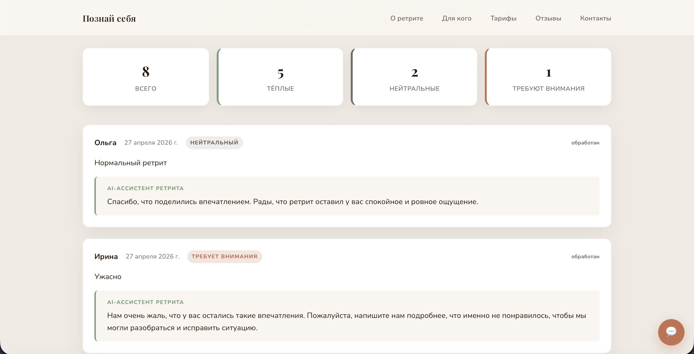
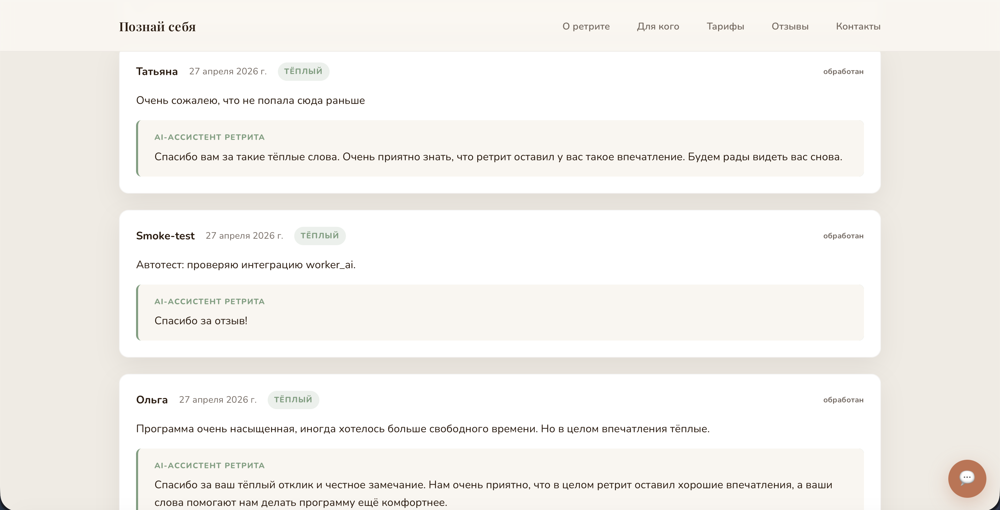
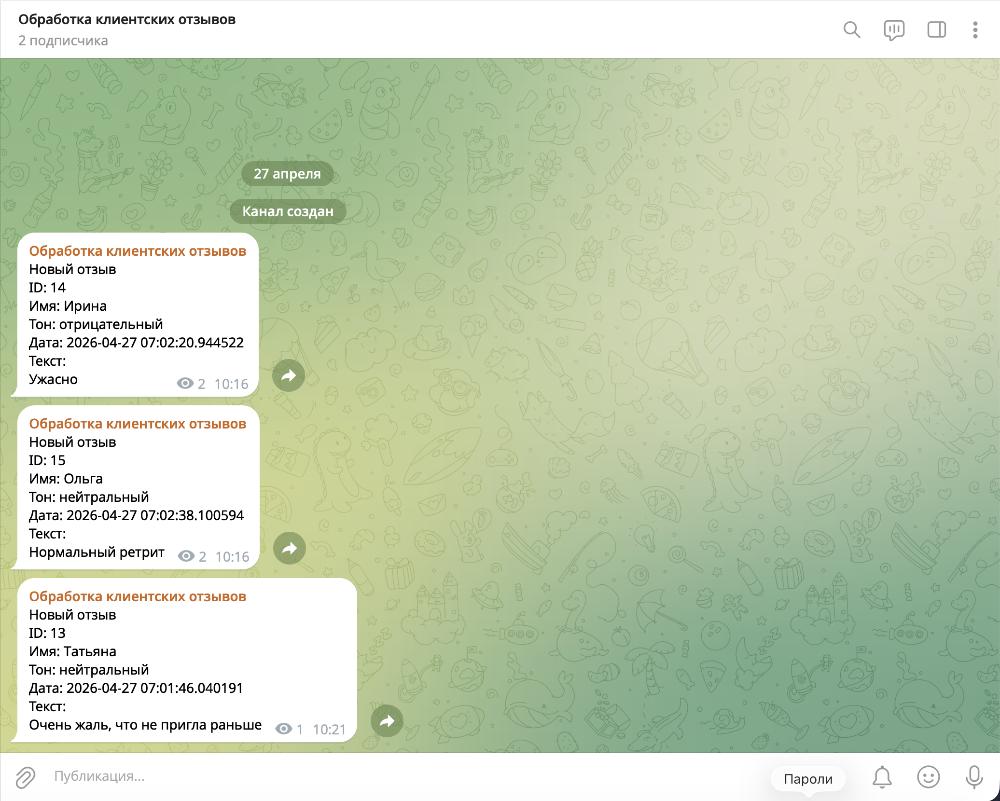

# AI Review Analyzer

AI-ассистент по работе с отзывами для женского ретрита «Познай себя».
Боевая площадка — лендинг [retreat.tatidzufri.com](https://retreat.tatidzufri.com).

## Краткое описание

Сервис, который **сам отвечает на отзывы** посетителей сайта и **присылает уведомления о новых отзывах в Telegram** владельцу. Ассистент определяет настроение каждого сообщения — тёплое, нейтральное или с замечанием — и пишет уместный человеческий ответ от имени команды.

## Задача

У ретрита есть лендинг, через который оставляют обратную связь. Хотелось:

- собирать отзывы прямо на сайте, без сторонних виджетов и регистраций;
- видеть каждое новое сообщение в Telegram, чтобы не пропустить негатив;
- отвечать живым, тёплым языком — но не садиться каждый раз писать руками;
- понимать общую картину: сколько тёплых отзывов, сколько с замечанием.

Если делать всё вручную — это нагрузка на ведущую и риск, что плохой отзыв провисит несколько дней без реакции. Готовые сервисы либо платные, либо отвечают шаблонно и не попадают в тон проекта.

## Решение

Связка из двух частей:

1. **Сайт.** Добавлена секция «Отзывы участниц» с формой подачи и плитками статистики: «всего / тёплые / нейтральные / требуют внимания». Под каждым отзывом сразу видно ответ AI-ассистента.
2. **AI-ассистент.** Фоновый процесс, который раз в полминуты заглядывает в базу отзывов. Если появился свежий — определяет настроение, пишет ответ на русском от лица команды ретрита и оставляет его прямо под отзывом на сайте. Параллельно дублирует короткую сводку в Telegram-канал владельцу.

Главная особенность — настроение и сам ответ оцениваются **большой языковой моделью**, а не списком ключевых слов. Поэтому неоднозначные фразы вроде «Долго сомневалась, но решилась — лучшее моё вложение в себя» корректно распознаются как тёплые, а не как негатив из-за слова «долго».

## Как это выглядит

**Секция отзывов на сайте.** Сверху — четыре плитки со статистикой. Ниже — карточки отзывов: имя автора, дата, статус «обработан», бейдж с тональностью и текст. Под отзывом — ответ от AI-ассистента в выделенном блоке.

**Ответы подстраиваются под тон отзыва.** Тёплый получает искреннюю благодарность, нейтральный — короткое спокойное отражение, отзыв с претензией — мягкое извинение и приглашение разобраться. Никаких канцеляризмов и шаблонных подписей.

**Уведомления в Telegram.** Каждый новый отзыв автоматически прилетает в канал владельца с ID, именем автора, определённым тоном, датой и текстом. Так можно вовремя зайти на сайт и при необходимости поправить ответ руками.

## Что в результате

- **Меньше ручной работы.** Ответы под отзывами появляются сами, в течение получаса с момента отправки.
- **Ничего не теряется.** Даже если AI-ассистент промахнётся с тональностью, уведомление в Telegram даст возможность зайти и поправить.
- **Тёплый стиль.** Ответы укладываются в три предложения, без штампов и без подписи. Стиль зафиксирован в инструкции для ассистента.
- **Видна общая картина.** Плитки наверху секции показывают, какая часть отзывов в каком настроении.
- **Защита от подделок.** Поставить отзыву статус «обработан» или дать ему ответ может только AI-ассистент. Посетители сайта пишут только сами отзывы.

## Стек технологий

| Технология | Зачем используется |
|---|---|
| **Python** | Язык, на котором написан и сайтовый API, и AI-ассистент. Удобен для быстрого развития и хорошо ложится на работу с языковыми моделями. |
| **FastAPI** | Лёгкий веб-фреймворк для серверной части сайта: приём отзывов через форму, отдача списка отзывов на страницу, обновление статусов от AI-ассистента. |
| **SQLite + SQLAlchemy** | Хранение отзывов и ответов. SQLite — простая файловая база, не нужен отдельный сервер БД: вся история живёт в одном файле. SQLAlchemy позволяет в любой момент пересесть на PostgreSQL или MySQL без переписывания кода. |
| **OpenAI API (GPT-5.4-mini)** | Сердце AI-ассистента. Одним запросом модель и определяет настроение отзыва, и формулирует ответ на русском в нужном тоне. |
| **Telegram Bot API** | Канал уведомлений для владельца. Бот шлёт сводку по каждому новому отзыву в закрытый канал. |
| **HTML, CSS, Vanilla JavaScript** | Фронтенд секции отзывов: форма, карточки, плитки со статистикой. Без тяжёлых фреймворков — чтобы блок легко вставлялся в существующий статический лендинг. |
| **nginx** | Веб-сервер на боевом VPS: раздаёт статику лендинга и направляет запросы к API на нужный внутренний порт. Благодаря этому сайт и его API живут на одном домене. |
| **systemd** | Менеджер сервисов на сервере. Запускает API и AI-ассистента при старте машины, перезапускает их при падении, ведёт логи. |
| **Ubuntu Server** | Операционная система боевого сервера. Стабильная, с готовыми пакетами для Python и nginx. |

## Структура репозитория

- `site/` — лендинг ретрита и его серверная часть, включая секцию отзывов с формой.
- `worker_ai/` — фоновый AI-ассистент: ходит за новыми отзывами, отвечает на них, шлёт уведомления в Telegram.
- `update_site.py` — управляющий скрипт. Через него запускается локальная разработка, прогоняются проверки совместимости, генерируется встраиваемый блок отзывов и отправляется обновление на сервер.
- `demo/` — скриншоты с боевого сайта и Telegram-канала.

## Автор

Татьяна Дзюфри — портфолио по промпт-инжинирингу и AI-ассистентам.
